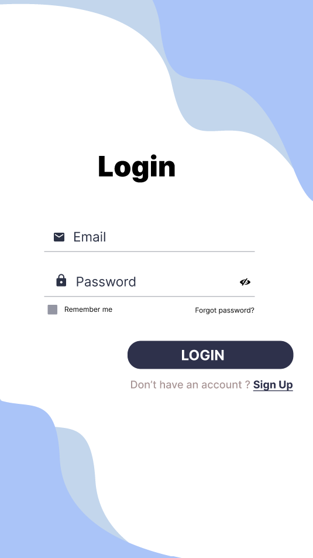
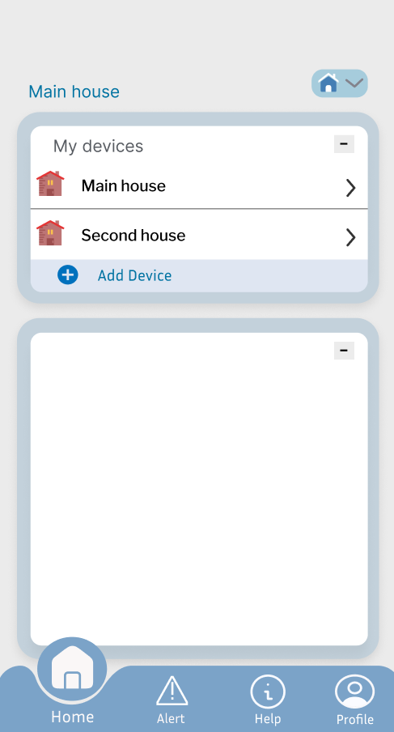
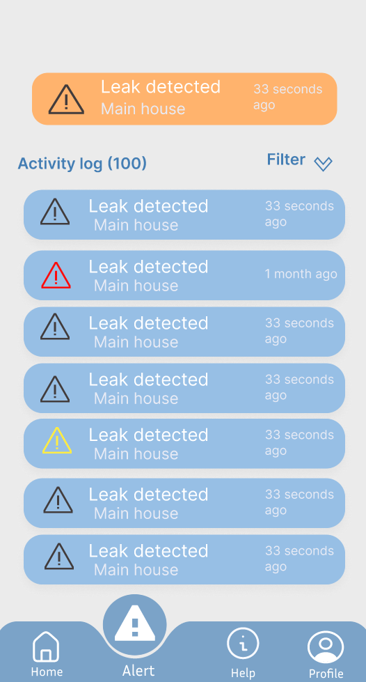
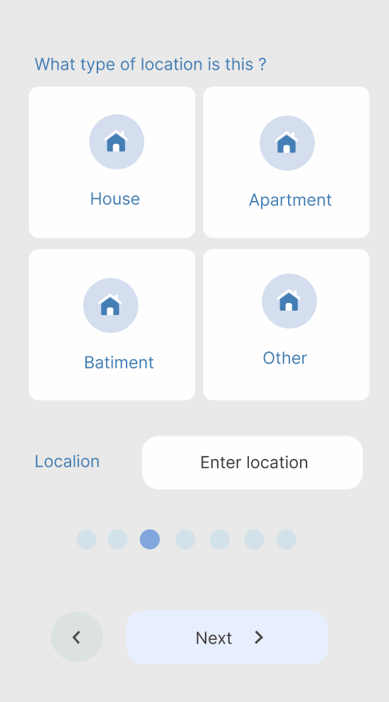
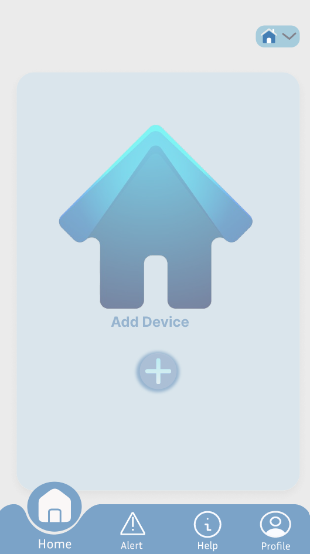

## 📱 Application Mobile

1. **Contrôle à Distance du Débit d'Eau**
   - Permet aux utilisateurs de contrôler le débit d'eau à distance.
   
2. **Surveillance en Temps Réel**
   - Surveille le débit d'eau en temps réel grâce à des capteurs avancés.
   
3. **Calcul de la Consommation Instantanée**
   - Calcule la consommation d'eau instantanée, offrant aux utilisateurs des informations précises sur leurs habitudes de consommation.
   
4. **Détection des Fuites**
   - Détecte les fuites d'eau précocement, empêchant le gaspillage d'eau et les dommages potentiels.

5. **Interface Utilisateur Intuitive**
   - Intégration d'une application conviviale permettant aux utilisateurs de surveiller et de gérer leur consommation d'eau avec facilité.
## Prototype

